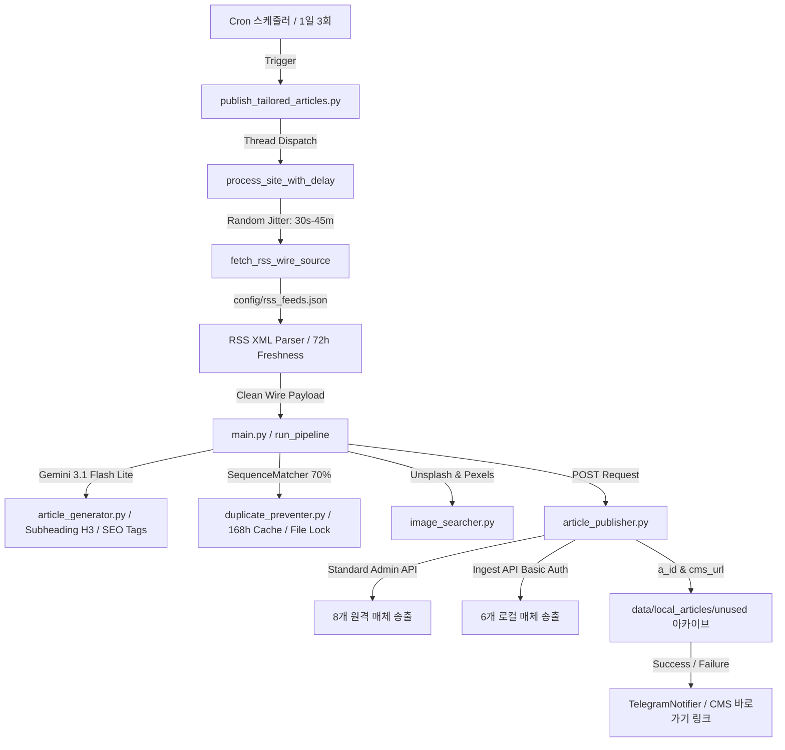

# System Blueprint: AI 기사 수집, 생성 및 자동 송출 시스템

본 문서는 실시간 고품질 뉴스 피드(RSS)를 수집하고, LLM(Gemini API)을 활용해 팩트 기반의 기사를 작성한 뒤, 저작권 프리 이미지를 매핑하여 원격 CMS(어드민 API 및 Ingest API)로 무작위 분산 송출을 처리하는 AI 기자 프로그램의 종합 설계도 및 개발 진행 상황을 명시합니다.

---

## 1. 시스템 아키텍처 개요 (Overview)

본 시스템은 매시간 주기적으로 작동하는 자동화 배치 프로그램으로, 다중 스레드 환경 하에서 기사의 팩트성 확보, 중복 발행(도배) 방지, 실시간 알림, 그리고 14개 미디어 채널에 대한 맞춤형(Tailored) 송출 정합성을 보장합니다.

---

## 2. 핵심 컴포넌트 상세 설계 (Core Components)

### 2.1 오케스트레이터 및 배치 제어
- **`publish_tailored_articles.py`**:
  - 시스템의 전체 구동을 제어하며, 14개 사이트를 **병렬 멀티스레드(Threading)** 구조로 분산 처리합니다.
  - **무작위 딜레이(Random Jitter)**: 각 스레드는 시작 시 `30초 ~ 45분` 사이의 랜덤 오프셋만큼 대기 후 기상을 시작하여 기계적인 발행 패턴을 원천 회피합니다.
  - **90/10 확률 분배**: 90% 확률로 해당 사이트 고유 테마의 뉴스를, 10% 확률로 일반(General) 뉴스를 채택하도록 분기 처리합니다.
- **`main.py`**:
  - `run_pipeline(source_file_path, target_sites)`을 구동하는 핵심 파이프라인 엔진입니다.
  - 기사 생성, 중복 차단, 이미지 매핑, 실송출, 아카이빙, 텔레그램 연동의 전체 트랜잭션을 조율합니다.
  - **`TelegramNotifier`**: 텔레그램 API를 활용하여 발행 성공/실패 알림을 전송하며, 본문 HTML이 4000자를 넘을 경우 태그가 깨지지 않게 **3800자 단위로 자동 분할(Part 1/2) 송출**합니다.

### 2.2 기사 팩트 수집 및 동기화 (RSS Feed Engine)
- **`sync_rss_feeds.py`**:
  - [categories.md](file:///home/stock_trading_bot/categories.md) 마크다운에 기재된 11대 카테고리별 83개 고품질 RSS 피드를 파싱합니다.
  - 기존 [config/rss_feeds.json](file:///home/stock_trading_bot/config/rss_feeds.json)의 데이터 유실 없이 **신규 피드를 추가(Append)하되 중복 주소는 자동 소거**하여 갱신합니다.
- **`publish_tailored_articles.py > fetch_rss_wire_source()`**:
  - RSS URL 목록을 무작위 셔플하고, 상위 7개 아이템 중 미사용 소스를 임의 선택합니다.
  - **최신성 필터(72시간)**: 발행 시간이 72시간을 초과한 오래된 뉴스는 수집 단계에서 배제합니다.
  - **중복 링크 배제(168시간)**: 최근 7일 내에 동일한 RSS 원천 링크가 기사 작성에 쓰였다면 수집 대상에서 영구 제외합니다.

### 2.3 기사 본문 및 태그 생성 (AI Writer)
- **`article_generator.py`**:
  - Gemini API를 호출하여 입력받은 RSS 팩트에 기반한(Fact Grounding) 고품질 저널리즘 기사를 영어로 작성합니다.
  - **소제목 템플릿 통일**: 본문 내 모든 소제목은 오직 `<h3>` 태그만을 사용하도록 프롬프트 상으로 강제합니다. (타 헤더 태그 및 볼드 기법의 혼용 차단)
  - **SEO 태그 추출**: 작성된 기사 내용과 연관된 고유 맞춤형 SEO Tag 20개를 자동 추출하여 기사 발행 메타데이터에 연동합니다.

### 2.4 완벽한 중복 발행 차단 (Duplicate Preventer)
- **`duplicate_preventer.py`**:
  - 동시 다발적인 스레드 구동 환경에서 데이터 충돌(Race Condition)을 막기 위해 **파일 락(`fcntl`)** 기반의 안전한 동시성 입출력 구조를 구축했습니다.
  - **유사도 70% 차단**: 생성된 제목이 최근 168시간(7일) 이력의 제목들과 비교해 `difflib.SequenceMatcher` 기준 70% 이상 유사할 경우, 해당 제목을 Negative Constraint로 삼아 **최대 3회 즉시 재생성(Retry)**을 시도합니다.
  - **매체 간 3개 겹침 차단**: 최근 168시간 내에 전체 도메인을 통틀어 이미 2회 이상 사용된 RSS 원천 소스는 타 도메인에서 사용할 수 없도록 원천 차단하여 동일 뉴스가 매체 전체에 도배되는 것을 완벽히 예방합니다.
  - **카테고리 제약 필터**: 특정 카테고리가 2회 연속으로 발행되거나, 일일 발행 한도(로컬 1개, 원격 2개)를 초과할 경우 해당 카테고리는 Gemini에 전달될 카테고리 후보군에서 제외시킵니다.

### 2.5 원격 어드민 및 Ingest API 송출 (Publisher)
- **`article_publisher.py`**:
  - **표준 어드민 API (`articles.php`)**: 8개 원격 미디어 사이트에 대해 multipart/form-data 인코딩을 거쳐 대표 이미지 바이너리와 함께 기사 초안(Draft)을 등록합니다.
  - **Article Ingest API (`/ingest/article`)**: 6개 로컬 작성 전용 매체(`jobsnhire`, `franchiseherald`, `mobilenapps`, `parentherald`, `booksnreview`, `foodworldnews`)를 대상으로 HTTP Basic Auth 인증을 거쳐 기사를 Queued 상태로 자동 실송출합니다.
  - **실시간 ID 룩업**: Ingest API 호출 전 `/ingest/reporters`, `/ingest/categories`, `/ingest/sources`를 실시간 조회하여 LLM이 선정한 카테고리와 가장 매칭률이 높은 정수형 카테고리 ID, 디폴트 기자 ID를 매핑해 냅니다.
  - **409 예외 흡수**: 이미 등록된 `external_id` (제목 해시 기반)의 기사를 재송출하려 시도할 경우, API 응답 사양에 명시된 `409 Conflict` 속에서 기존 `a_id` 및 `cms_url`을 추출해 정상 성공 처리로 마이그레이션합니다.

---

## 3. 실행 및 아카이브 데이터 흐름 (Data Management)

- **원격 송출 완료 기사**:
  - `data/generated_articles/` 에 `domain_article_id.json` 형태로 캐싱 적재됩니다.
  - **10일 자동 청소**: 생성된 지 10일(240시간)이 지난 캐시 파일은 디스크 용량 관리를 위해 메인 프로세스 종료 시 자동 삭제됩니다.
- **로컬 송출 완료 기사**:
  - `data/local_articles/unused/` 에 `domain_a_id.json` 형태로 물리 격리 저장됩니다.
  - 동영상이나 미디어 리소스의 수동 관리를 위해 사용자가 `mark_article_used.py` CLI 도구를 사용해 해당 기사를 `used/` 폴더로 손쉽게 이동 및 관리 마킹할 수 있게 설계되었습니다.
- **실시간 로깅**:
  - `logs/{domain}.log` 경로로 각 스레드별 작업 상황이 완전 격리 저장되어 디버깅과 추적성을 대폭 향상했습니다.

---

## 4. 진행 현황 요약 (Progress Log)

1. **폴더 구조 및 파일 정리**: 외부 API 호출부 분할 및 환경 정보 `.env` 안전 격리 완료.
2. **카테고리 캐싱 연동**: 8개 사이트의 카테고리 130종 동기화 자동화 구축.
3. **대표 이미지 멀티파트 업로드**: 이미지 바이너리 폼 데이터 업로드 및 PHP 백엔드 작은따옴표 백슬래시 오류 우회 완료.
4. **텔레그램 알림 구현**: 간소화된 텔레그램 기사 송출 성공/실패 레이아웃 추가.
5. **무작위 시각 송출 분산**: 멀티스레드 기상 및 랜덤 오프셋 대기 도입.
6. **7일 중복 차단 및 중복 소스 필터**: SequenceMatcher 70% 검증, 최근 168시간 사용 RSS 링크 배제 셔플러 탑재.
7. **RSS 최신성 필터**: 72시간 이내 발행 뉴스 강제화 및 오래된 소스 스킵 완료.
8. **로컬 매체 격리 폴더 관리**: jobsnhire 및 5종 매체 격리 보관 폴더 분리 및 CLI 도구(`mark_article_used.py`) 구현.
9. **소제목 태그 통일 및 SEO 태그 20개**: `<h3>` 태그 강제 및 기사별 20개 맞춤형 태그 메타 데이터 탑재 완료.
10. **동시성 덮어쓰기 유실 방지**: File Lock 도입을 통해 동시 다발성 스레드 레이스 컨디션 해결.
11. **categories.md 피드 병합**: 11대 카테고리 83개 고품질 RSS 피드를 기존 설정에 중복 없이 추가 병합 완료.
12. **Article Ingest API 이식 완료**: 로컬 전용 6개 사이트의 API 실전 이식, 409 Conflict 처리 및 실전 모의 등록 검증 완료. (a_id 획득 및 텔레그램 연계 완료)
