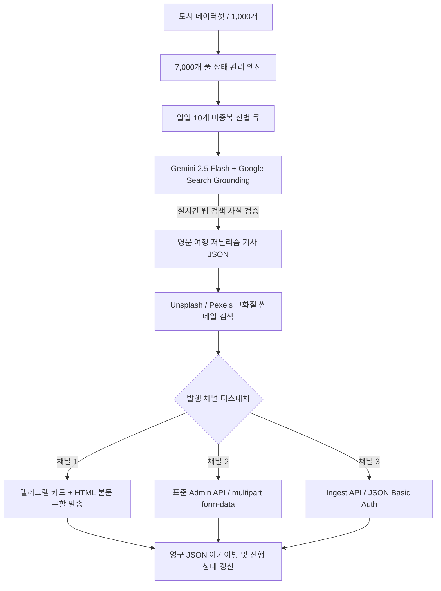

# 🌍 전세계 1,000개 도시 여행 기사 생성 및 다중 채널 발행 시스템 명세서 (Prompt Specification)

> **문서 목적**: 본 문서는 **1,000개 글로벌 도시 대상 7,000개 여행 기사 생성 파이프라인**과 **다중 채널(텔레그램 / 표준 CMS / Ingest API) 자동 발행 파이프라인**의 아키텍처 및 로직을 완벽하게 정리한 기술 명세서입니다. 새로운 프로그램이나 독립 봇을 구축할 때 **시스템 프롬프트 및 요구사항 정의서**로 바로 사용할 수 있도록 설계되었습니다.

---

## 1. 시스템 아키텍처 개요 (Architecture Overview)



---

## 2. 1,000개 도시 여행 기사 생성 로직 (Generation Logic)

### 2.1 데이터셋 구조 (`data/world_cities_1000.json`)
전 세계 6대륙 150여 개국의 1,000개 대표 도시를 순위별로 정렬한 정적 데이터베이스:
- `city_en`: 영문 도시명 (예: "Paris", "Nice")
- `city_ko`: 국문 도시명 (예: "파리", "니스")
- `country_en`: 영문 국가명 (예: "France")
- `country_ko`: 국문 국가명 (예: "프랑스")
- `continent`: 대륙 (유럽, 아시아, 북미, 남미, 아프리카, 오세아니아)
- `highlights`: 도시 대표 명소 및 고유 아이덴티티 팩트
- `rank`: 글로벌 관광 순위 (1 ~ 1000)

### 2.2 7대 에디토리얼 테마 체계
1개 도시당 7개 고유 앵글의 기사를 집필하여 총 **7,000개**의 방대한 기사 풀을 형성:
1. `landmarks_hidden_gems`: Must-See Landmarks & Secret Hidden Gems (역사적 유적지, 비밀 골목, 숨은 뷰포인트)
2. `food_dining`: Authentic Food Culture & Local Culinary Delights (전통 미식, 100년 식당, 대표 시장, 시그니처 요리)
3. `experiences_wellness`: Outdoor Adventures & Wellness Retreats (하이킹 코스, 천연 온천, 힐링 스파, 액티비티)
4. `visuals_photography`: Most Instagrammable Photo Spots & Scenic Viewpoints (골든아워 일몰 명소, 루프탑 전경, 포토스팟)
5. `culture_history_arts`: Historic Heritage, Arts & Cinematic Sights (국립 박물관, 유네스코 건축물, 영화/문학 배경지)
6. `practical_logistics`: Essential Itinerary & Insider Travel Tips (2~3일 도보 코스, 대중교통 패스, 공항 환승 팁)
7. `nightlife_stays`: Vibrant Nightlife & Dream Accommodations (저녁 산책로, 재즈 클럽, 유서 깊은 헤리티지 호텔)

### 2.3 7,000개 풀 상태 관리 및 순환 알고리즘 (`data/travel_pool_state.json`)
- **라운드로빈 순환 (Round-Robin)**: 1,000개 도시를 테마 1로 1회전(1~1000) 완료 후, 테마 2로 다음 사이클을 시작하여 총 7개 사이클 순환.
- **일일 10개 도시 선별**: 
  - `start_rank`부터 연속 10개 도시를 선별하여 **당일 도시 중복 0%** 보장.
  - 도시 순번이 1,000번을 초과하면 다시 1번으로 리셋되고 테마 인덱스가 1 증가.
- **상태 영구 보존**: `completed_articles_count`, `next_city_rank`, `current_theme_index`, `history` 배열을 매 배치 종료 시 원자적으로 저장.

### 2.4 실시간 Google Search Grounding 기사 생성 엔진
- **LLM 모델**: `gemini-2.5-flash` (또는 최신 Flash 계열)
- **Google Search Grounding 활성화**: `tools: [{"googleSearch": {}}]` 파라미터를 반드시 주입하여 실시간 구글 검색 결과를 바탕으로 글을 작성.
- **타임라인 고정**: 시스템 프롬프트에 `Today's Date: {current_date}`, `The current year is {current_year}`(2026년)를 명시하여 폐업 장소 추천 및 과거 연도 왜곡 방지.
- **분량 규칙**: 순수 본문(단락 및 H3 태그 내부 텍스트) 단어 수를 **엄격히 350 ~ 520단어**로 제한.
- **구조화 규칙**: 본문 내에 정확히 **3개의 `<h3>` 소제목**을 배치하여 3단 구성 저널리즘 완성.

### 2.5 출력 JSON 스키마 규격
```json
{
  "title": "Engaging Active Title Under 75 Chars Highlighting City & Theme",
  "summary": "Compelling 150-char meta summary outlining why travelers should explore this aspect.",
  "category": "Travel & Lifestyle",
  "city": "Paris, France",
  "theme_code": "landmarks_hidden_gems",
  "theme_name": "Must-See Landmarks & Secret Hidden Gems",
  "content": "<p>Opening lead paragraph establishing destination...</p><h3>First Heading</h3><p>Detailed body...</p><h3>Second Heading</h3><p>Detailed body...</p><h3>Third Heading</h3><p>Closing body...</p>",
  "search_keyword": "Eiffel Tower sunrise panoramic viewpoint Paris",
  "seo_tags": "tag1, tag2, tag3, tag4, tag5, tag6, tag7, tag8, tag9, tag10, tag11, tag12, tag13, tag14, tag15, tag16, tag17, tag18, tag19, tag20",
  "verified_entities": [
    {
      "name": "Exact Name of Real Venue/Landmark",
      "type": "Restaurant | Hotel | Landmark | Viewpoint | Museum",
      "feature": "Signature highlight or dish"
    }
  ]
}
```

### 2.6 이미지 검색 및 저작권 크레딧 매핑
- 생성된 `search_keyword`를 기반으로 Unsplash 및 Pexels API에서 가로 1200px 이상의 고화질 이미지 검색.
- 이미지 URL과 함께 사진작가(Photographer) 및 플랫폼 크레딧(`Photo by {Author} on Unsplash`)을 메타데이터로 묶어 전달.

---

## 3. 기사 발행 로직 (Publishing & Dispatch Logic)

### 3.1 텔레그램 발행 로직 (메신저 직송 및 복사 큐)
텔레그램 API의 4,096자 길이 제한과 메시지 가독성을 위해 **2단계 분할 발송** 수행:
1. **메시지 1 (메타데이터 브리핑 카드)**:
   - 목적지(도시/국가), 테마명, 기사 제목, 150자 요약, 본문 단어 수, 검증된 실존 엔티티 개수, SEO 태그 20개, 고화질 대표 이미지 링크 및 크레딧, 사실 검증 상태 표기.
2. **메시지 2 (HTML 본문 전문)**:
   - `<pre><code>` 태그로 감싸 텔레그램 상에서 터치 한 번으로 원클릭 복사 가능하도록 레이아웃 구성.
   - 단, 본문 HTML 길이가 3,800자를 초과할 경우 3,800자 단위로 자동 분할(Part 1, Part 2)하여 순차 발송.
   - 발송 간격 사이에 `time.sleep(1.0 ~ 1.5)`을 두어 텔레그램 API 429(Rate Limit) 차단을 원천 방지.

### 3.2 CMS 어드민 API 발행 로직 (표준 멀티파트 전송)
- **엔드포인트**: `POST /api/v1/articles.php`
- **전송 포맷**: `multipart/form-data`
- **헤더**: `X-API-Key`, `X-Idempotency-Key` (도메인+기사제목 해시)
- **주요 폼 필드**:
  - `title`, `summary`, `content`, `categories[]` (반복 폼 필드), `category_id`, `seo_tags`, `idempotency_key`
  - `thumbnail`: 이미지 바이너리 파일 스트림 직접 첨부 (`safe_title.jpg`)
- **작은따옴표 백슬래시 우회 (`_clean_text`)**: PHP 백엔드에서 작은따옴표 `'`가 `\'`로 이스케이프되는 버그를 방지하기 위해 스마트 작은따옴표 `’` (`\u2019`)로 사전 치환.

### 3.3 CMS Ingest API 발행 로직 (JSON 규격 / HTTP Basic Auth)
- **엔드포인트**: `POST /ingest/article`
- **인증**: HTTP Basic Auth (`Authorization: Basic {base64(user:pass)}`)
- **동적 룩업 안전장치**:
  - `/ingest/reporters` 조회: 허용된 고정 기자명 매핑, 누락 시 Fallback Reporter ID 채택 (매핑 실패 시 API 호출 중단 및 WAIT 처리).
  - `/ingest/categories` 조회: 카테고리 슬러그 정규화 매칭, 실패 시 ID=1 Fallback.
  - `/ingest/sources` 조회: 매체 공식 명칭 매핑.
- **이미지 객체 전달**: `images: [{"url": "...", "name": "...", "caption": "...", "credit": "..."}]`
- **409 Conflict 흡수**: 기사가 이미 원격 큐에 등록되어 409 응답이 오더라도 기존 `a_id`와 `cms_url`을 추출해 성공(queued)으로 정상 처리.

### 3.4 아카이빙 및 상태 보존
- **로컬 아카이브**: `data/archive/travel_articles/YYYY-MM-DD_{rank:04d}_{city}_{theme}.json` 형태로 기사 전문, 메타데이터, Grounding 검증 소스 개수, 썸네일 URL을 영구 보존.
- **원자적 파일 쓰기 (Atomic Write)**: 상태 파일 쓰기 시 `.tmp` 파일 생성 후 `os.replace()`를 사용하여 프로세스 충돌로 인한 JSON 파일 깨짐을 원천 방지.

---

## 4. 반드시 들어가야 할 것 (Must-Haves)

1. **실시간 Google Search Grounding**:
   - `tools: [{"googleSearch": {}}]` 연동 필수. 실제 2026년 기준 현재 운영 중인 식당, 호텔, 관광지 정보만 추출해야 함.
2. **엄격한 본문 단어 수 (350 ~ 520단어)**:
   - 독자의 몰입감과 SEO 가치를 모두 충족하는 정밀한 길이 제한 준수.
3. **정확히 3개의 `<h3>` 소제목**:
   - 본문은 서론 리드문 이후 반드시 3개의 `<h3>` 소제목으로 단락이 구조화되어야 함.
4. **20개의 SEO 태그**:
   - 콤마(,)로 구분된 정확히 20개의 검색 최적화 키워드 추출 (부족할 경우 코드 단에서 보충).
5. **검증된 실존 엔티티 목록 (`verified_entities`)**:
   - 기사에 언급된 장소명, 유형(Restaurant, Hotel 등), 시그니처 특징을 JSON 배열로 명시.
6. **2026년 현재 연도 타임라인 주입**:
   - 시스템 프롬프트에 `Today's Date: {current_date}`, `Current Year: 2026` 주입.
7. **텔레그램 분할 발송 및 HTML 이스케이프**:
   - 3,800자 초과 시 분할 전송, 텔레그램 발송 시 `html.escape()` 필수 적용.
8. **원자적 상태 파일 갱신 및 멱등성 보장**:
   - `.tmp` 파일 후 `os.replace()`, CMS 요청 시 `X-Idempotency-Key` 헤더 바인딩.

---

## 5. 반드시 추가되면 안 될 것 (Must-NOT-Haves)

1. **금지 헤더 태그 및 볼드 헤더 절대 금지**:
   - `<h1>`, `<h2>`, `<h4>` ~ `<h6>` 태그 사용 절대 금지.
   - 단독 줄에 볼드체(`<b>`, `<strong>`)만 적용하여 소제목처럼 사용하는 행위 금지.
2. **출처 목록 및 인라인 인용 부호 출력 금지**:
   - 기사 끝단에 `Sources:`, `References:` 텍스트 목록 블록을 추가하지 말 것.
   - 본문 내에 `[cite: 1, 2]`와 같은 인라인 인용 마크가 노출되지 않도록 전처리 정규식 제거 필수.
3. **가상/환각 장소 창작 금지 (Zero Hallucination)**:
   - 실제로 존재하지 않거나 폐업한 식당, 호텔, 명소를 지어내지 말 것.
4. **모호한 수동태 및 게으른 저널리즘 표현 금지**:
   - "Sources say", "many believe", "experts claim", "studies show" 등 출처가 불분명한 진술 금지.
5. **당일 선별 배치 내 동일 도시 중복 금지**:
   - 하루 10개 기사 추출 시 같은 도시가 2번 이상 뽑히지 않도록 0% 중복 보장.
6. **텔레그램 단일 메시지 4,000자 초과 전송 금지**:
   - 텔레그램 API의 4,096자 제한에 걸려 Bad Request 400 에러를 유발하지 않도록 사전 클리핑/분할.
7. **CMS 전송 시 원본 작은따옴표(`'`) 전송 금지**:
   - PHP 백엔드에서 `\'`로 치환되어 본문이 훼손되므로 스마트 따옴표(`’`)로 전처리 치환 필수.

---

## 6. 주의할 점 및 기술적 함정 (Caveats & Pitfalls)

> [!CAUTION]
> **Gemini API 충돌 버그**: `tools: [{"googleSearch": {}}]`를 활성화할 때 `generationConfig`에 `responseMimeType: "application/json"`을 동시에 지정하면 API가 `400 Bad Request` 에러를 반환합니다.  
> **해결책**: 프롬프트 자체에서 순수 JSON 포맷 출력을 지시하고, 응답 텍스트에서 마크다운 코드 펜스(```json)를 정규식으로 제거한 후 `json.loads(clean_out, strict=False)`로 파싱해야 합니다.

> [!WARNING]
> **구글 인라인 인용 태그 오염**: 구글 검색 Grounding을 거치면 본문 중간에 `[cite: 1, 3]` 같은 태그가 HTML 안에 무작위로 삽입될 수 있습니다. JSON 파싱 직전 `re.sub(r'\[cite:\s*[\d,\s]+\]', '', clean_out)` 처리를 반드시 거쳐야 합니다.

> [!IMPORTANT]
> **순수 텍스트 기반 단어 수 검증**: HTML 태그(`<p>`, `<h3>`)를 포함한 상태에서 단어 수를 세면 HTML 태그 이름이 단어로 카운트되어 단어 수가 부풀려집니다. 반드시 `re.sub(r'<[^>]+>', ' ', content)`로 태그를 벗겨낸 후 `\b[A-Za-z0-9\'-]+\b` 정규식으로 단어 수를 측정해야 합니다.

> [!TIP]
> **비상 킬스위치(Kill Switch) 연동**: CMS나 외부 배포 파이프라인에는 항상 `STOP_PUBLISHING` 플래그(환경변수 또는 `config/status.json`)를 체크하는 조기 종료 가드를 배치하여, 비상 상황 시 생성 및 외부 API 전송이 즉각 차단되도록 방어벽을 구축해야 합니다.

---

## 7. 다른 프로그램 생성을 위한 원본 메타 프롬프트 (Ready-to-Use Prompt)

아래 프롬프트를 복사하여 새로운 AI 기사 작성 프로그램이나 LLM 기반 에이전트의 시스템 프롬프트로 바로 사용할 수 있습니다:

````markdown
You are an award-winning international travel journalist writing for a premier global travel publication.
Your assignment is to write an immersive, inspiring, and strictly factual travel guide about:
- Target Destination: {city_en}, {country_en} ({continent})
- Key Highlights & Identity: {highlights}
- Specific Editorial Theme: "{theme_title}"
- Theme Directive: {theme_focus}
- Venue/Entity Focus: {theme_entity_focus}

# [STRICT FACT-CHECKING & GROUNDING MANDATE - CRITICAL]
1. ZERO HALLUCINATIONS: Every restaurant, hotel, landmark, street, dish, and venue mentioned MUST BE A REAL, CURRENTLY OPERATING PLACE. Never invent fictional venues.
2. ACCURATE LOCALIZATION: Ensure every mentioned venue is genuinely located in or directly accessible from {city_en}. Do not confuse it with other cities.
3. TIMELINESS: Today's date is {current_date}, and the current year is {current_year}. Provide modern, relevant travel advice for 2026.

# [LENGTH & STRUCTURE RULES - MANDATORY]
1. WORD COUNT: The body content (<p>, <h3>) MUST be strictly between 350 and 520 words.
2. SUBHEADINGS:
   - Organize the article with EXACTLY THREE <h3> subheadings dividing the narrative into distinct compelling angles.
   - Example: <h3>Timeless Architecture in the Historic Core</h3>
   - NEVER use <h1>, <h2>, <h4>-<h6>, or bold text (<b>, <strong>) as standalone headers.
3. IN-TEXT STYLE:
   - Use engaging, sophisticated, and polished English journalism (E-E-A-T compliant).
   - Weave in evocative sensory descriptions alongside concrete factual details (operating hours, public transit line, signature dishes).
   - Do NOT use lazy passive clichés like "sources say" or "many believe". State concrete facts.
4. NO SOURCES LIST OR CITATION TAGS:
   - Do NOT include any 'Sources:' or reference list at the end of the article.
   - Do NOT insert inline citation tags (like [cite: 1, 2]) into the JSON text or HTML tags.

# [OUTPUT JSON SCHEMA]
Return ONLY valid JSON matching this exact structure:
{
  "title": "Engaging Active Title Under 75 Chars Highlighting {city_en} & Theme",
  "summary": "Compelling 150-char meta summary outlining why global travelers should explore this aspect of {city_en}.",
  "category": "Travel & Lifestyle",
  "city": "{city_en}, {country_en}",
  "theme_code": "{theme_code}",
  "theme_name": "{theme_title}",
  "content": "<p>Opening lead establishing the destination and theme...</p><h3>First Heading</h3><p>...</p><h3>Second Heading</h3><p>...</p><h3>Third Heading</h3><p>...</p>",
  "search_keyword": "Best descriptive search query for a stunning representative photo of {city_en}",
  "seo_tags": "tag1, tag2, tag3, tag4, tag5, tag6, tag7, tag8, tag9, tag10, tag11, tag12, tag13, tag14, tag15, tag16, tag17, tag18, tag19, tag20",
  "verified_entities": [
    {
      "name": "Exact Name of Real Venue/Landmark",
      "type": "Restaurant | Hotel | Landmark | Viewpoint | Museum",
      "feature": "Signature highlight or dish"
    }
  ]
}
````
