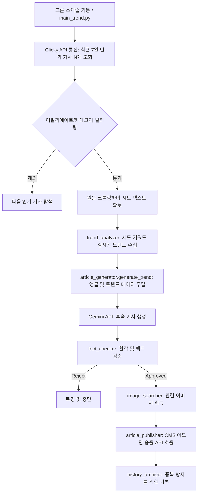

# 연관/후속 기사 생성 시스템 워크플로우 가이드

본 문서는 인기 기사를 기반으로 연관(Follow-up) 및 후속 기사를 자동으로 생성하고 발행하는 시스템의 워크플로우와 기술적 명세, 그리고 타 시스템 이식(Migration) 및 인수인계를 목적으로 작성된 가이드입니다.

---

## 1. 목적 (Purpose)

*   **트래픽 극대화**: 최근 7일 내 실질적인 조회수와 사용자 반응을 이끌어낸 '인기 기사'를 시드(Seed)로 삼아 추가적인 트래픽을 창출합니다.
*   **다양한 앵글의 콘텐츠 생산**: 원문 기사의 단순 요약이 아닌, 후속 조치, 심층 분석, 실무 가이드 등 새로운 관점(Angle)의 기사를 자동 생성합니다.
*   **인수인계 및 시스템 이식**: 타 환경이나 시스템으로 본 프로세스를 이식할 때 핵심 모듈과 외부 의존성을 명확히 파악할 수 있도록 돕습니다.

---

## 2. 사용되는 프로그램 및 스크립트 구성

시스템은 모듈화된 파이썬 스크립트로 구성되며, 메인 스크립트가 각 모듈을 오케스트레이션합니다.

1.  **`main_trend.py`**
    *   **역할**: 연관/후속 기사 생성 시스템의 **코어 메인 파이프라인**입니다.
    *   **주요 기능**: Clicky에서 인기 기사 조회, 대상 필터링, 하위 모듈 호출 및 전체 흐름 제어.
2.  **`trend_analyzer.py`** (`gather_trends` 함수)
    *   **역할**: 시드 기사의 핵심 키워드를 바탕으로 실시간 검색 트렌드를 수집합니다.
    *   **주요 기능**: Google Trends, Pinterest, Microsoft Ads 등에서 검색량 및 연관 키워드를 분석하여 기사 생성 시 최신 트렌드를 반영할 수 있는 컨텍스트 데이터를 만듭니다.
3.  **`article_generator.py`** (`generate_trend` 함수)
    *   **역할**: 생성형 AI(Gemini)에 프롬프트를 전달하여 실제 후속 기사 텍스트를 작성합니다.
    *   **주요 기능**: `[CRITICAL FOLLOW-UP ARTICLE INSTRUCTIONS]` 등 강력한 프롬프트 제약을 통해 단순 반복/복제를 금지하고, 새로운 저널리즘 앵글(Breaking, Deep Analysis 등)을 부여합니다.
4.  **`fact_checker.py`** (`verify_article_facts`)
    *   **역할**: AI 환각(Hallucination) 방지 및 편집실 가이드라인 준수 여부를 검사합니다.
5.  **`image_searcher.py`**
    *   **역할**: 생성된 후속 기사의 키워드를 기반으로 적합한 썸네일/헤더 이미지를 검색합니다.
6.  **`article_publisher.py`**
    *   **역할**: 최종 완성된 기사(본문, 이미지, 카테고리, 메타 태그 등)를 CMS 어드민 서버로 송출합니다.
7.  **`history_archiver.py`** & **`logger_setup.py`**
    *   **역할**: 송출된 기사의 히스토리를 저장하고, 도메인별 실행 로그를 기록합니다.

---

## 3. 시드 기사 출처 및 필터링 로직

후속 기사를 작성하기 위한 원본 데이터(Seed)는 **Clicky 웹 애널리틱스**에서 수집됩니다.

*   **시드 출처 API**: `Clicky API` (최근 7일 페이지 뷰 통계 조회)
    *   요청 파라미터: `type=pages&date=last-7-days`
*   **원문 획득**: Clicky에서 얻은 인기 기사 URL을 바탕으로 `main_trend.py` 내의 웹 스크래퍼(`fetch_article_body_text`)가 해당 페이지의 `
` 태그 텍스트를 추출하여 시드 텍스트로 활용합니다.
*   **필터링 알고리즘 (`is_affiliate_page`)**:
    *   **어필리에이트/프로모션 페이지 배제**: URL이나 제목에 쿠폰, 할인, 프로모션 관련 키워드(coupon, deal, discount, buy 등)가 포함된 경우 시드에서 제외합니다.
    *   **단순 카테고리/홈페이지 배제**: 구체적인 기사 본문이 없는 도메인 메인 페이지나 카테고리 인덱스 페이지를 식별하여 거릅니다.

---

## 4. 연관/후속 기사 생성 워크플로우

---

## 5. 사용되는 외부 API 및 자원

1.  **Gemini REST API (v1beta)**
    *   **목적**: LLM 텍스트 생성 (본문, 제목, 요약 등)
    *   **설정**: `config/settings.json` 내 `gemini-3.1-flash-lite` 등 모델명 및 토큰 설정. `GEMINI_API_KEY` 환경변수 사용.
2.  **Clicky API**
    *   **목적**: 사이트 방문자 로그 및 최상위 조회수 기사 식별 (`site_id`, `sitekey` 환경변수 활용)
3.  **트렌드 분석 API군**
    *   **Google Trends, Pinterest, Microsoft Ads API**: 기사의 화제성을 분석하기 위한 검색량 조회 (상세 내역은 `trend_analyzer.py`에 구현).
4.  **내부 CMS Ingest / Admin API**
    *   **목적**: 기사 발행. JSON 형태 또는 `multipart/form-data` 포맷을 통해 어드민으로 송출.

---

## 6. 시스템 이식 시 주의사항 (Migration Notes)

1.  **환경 변수 (`.env`) 설정**:
    *   `GEMINI_API_KEY`, Clicky 자격 증명(`SITE_ID`, `SITEKEY` 등), 송출 타겟 어드민 URL, CMS API Key가 반드시 세팅되어 있어야 합니다.
2.  **프롬프트 의존성**:
    *   `article_generator.py` 내의 정규식 제약 사항(`domain_specific_constraint`, `validate_anonymous_claims` 등)과 `data/Prompts/general_art.md` 템플릿 파일이 함께 이식되어야 정상적인 AI 출력을 보장할 수 있습니다.
3.  **크롤링 방어 기제 우회**:
    *   자사 사이트의 인기 기사를 `urllib`로 크롤링할 때, 서버의 WAF(Web Application Firewall)나 Cloudflare 등에서 봇으로 차단하지 않도록 타겟 서버측 방화벽 예외 처리가 필요할 수 있습니다.
4.  **저널리즘 가이드 강제 로직 유지**:
    *   단순 문장 교체가 아닌 **새로운 관점 도입(Follow-up Instructions)** 기능은 `article_generator.py`의 고유한 핵심 가치이므로 이식 시 로직이 유실되지 않도록 주의해야 합니다.
